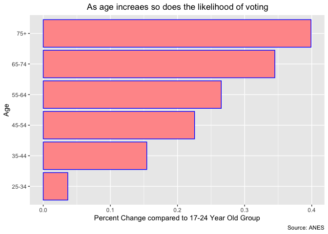
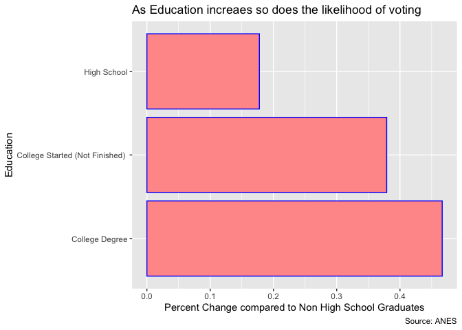
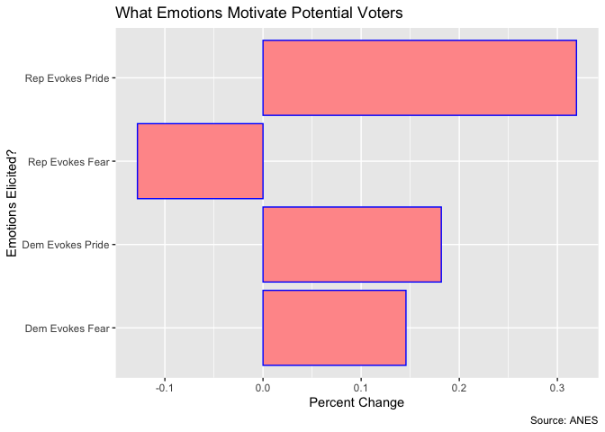
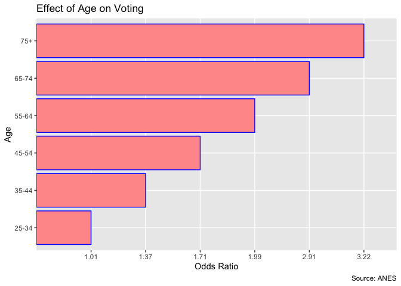
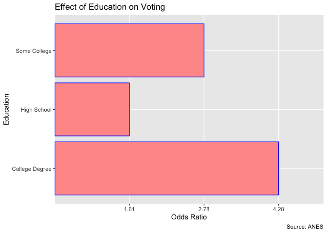
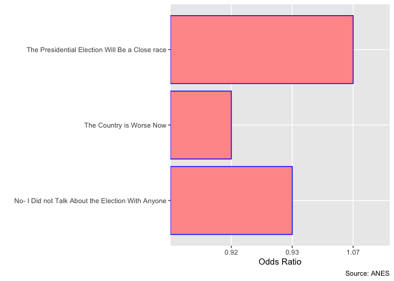

Analysis of the American National Election Survey
================

# Setting up the document to knit

# Will install packages if first time

``` r
# install.packages('dplyr') 
# install.packages('readr')
# install.packages('tidyr')
# install.packages('stringr')
# install.packages('forcats')
# install.packages('purr')
# install.packages('ggpubr')
# install.packages('car')
# install.packages('gdata')
# install.packages('skimr')
# install.packages('readxl')
# install.packages('scales')
# install.packages('janitor')
# install.packages('gtsummary')
# install.packages('srvyr')
# install.packages('broom')
# install.packages('ggstance')
# install.packages("margins")
# install.packages('haven')
# install.packages('rmarkdown')
```

# Read in the packages that are needed

``` r
library(readr)
library(tidyr) 
library(stringr) 
library(forcats) 
library(purrr) 
library(ggpubr) 
library(ggplot2)
library(car)
library(gdata)
library(skimr)
library(readxl)
library(dplyr) 
library(janitor)  
library(broom)
library(gtsummary)
library(srvyr)
library(ggstance)
library(margins)
```

# Import the data- ANES Survey Timeseries

# Will unzip the ANES data if needed

``` r
source("unzip-anes-data.r")
```

``` r
# Importing the main data set from the American National Election Survey

library(haven)

anes_timeseries_cdf_stata13 <- read_dta("data-raw/anes_timeseries_cdf_stata13.dta") %>% 
  zap_labels() %>% 
  zap_formats()
```

# Filtering for the right years (This analysis will include from 2004-2016)

``` r
Data_2004 <- anes_timeseries_cdf_stata13[!(anes_timeseries_cdf_stata13$VCF0004 < "2004"), ]
```

# Cleaning up the data

``` r
# Removing Labels

Data_2004 %>%
  zap_labels() %>%
  select(
    VCF0102,
    VCF0104,
    VCF0880,
    VCF0606,
    VCF0501,
    VCF9030a,
    VCF9206,
    VCF0105b,
    VCF0450,
    VCF0301,
    VCF9206,
    VCF9202,
    VCF9257,
    VCF0358,
    VCF0360,
    VCF0370,
    VCF0372,
    VCF9253,
    VCF0714,
    VCF9256,
    VCF0900b,
    VCF0114,
    VCF9021,
    VCF9030b,
    VCF9030c,
    VCF9222,
    VCF0901a,
    VCF0009z,
    VCF0310,
    VCF0358,
    VCF0360,
    VCF0370,
    VCF0372,
    VCF0359,
    VCF0361,
    VCF0371,
    VCF0373,
    VCF0702,
  ) %>%
  skim()
```

|                                                  |            |
| :----------------------------------------------- | :--------- |
| Name                                             | Piped data |
| Number of rows                                   | 13718      |
| Number of columns                                | 33         |
| \_\_\_\_\_\_\_\_\_\_\_\_\_\_\_\_\_\_\_\_\_\_\_   |            |
| Column type frequency:                           |            |
| numeric                                          | 33         |
| \_\_\_\_\_\_\_\_\_\_\_\_\_\_\_\_\_\_\_\_\_\_\_\_ |            |
| Group variables                                  | None       |

Data summary

**Variable type: numeric**

| skim\_variable | n\_missing | complete\_rate |    mean |      sd |     p0 |     p25 |     p50 |    p75 |    p100 | hist  |
| :------------- | ---------: | -------------: | ------: | ------: | -----: | ------: | ------: | -----: | ------: | :---- |
| VCF0102        |        226 |           0.98 |    3.93 |    1.72 |   1.00 |    2.00 |    4.00 |    5.0 |    7.00 | ▇▅▆▆▆ |
| VCF0104        |         41 |           1.00 |    1.53 |    0.50 |   1.00 |    1.00 |    2.00 |    2.0 |    3.00 | ▇▁▇▁▁ |
| VCF0880        |         91 |           0.99 |    1.99 |    0.88 |   1.00 |    1.00 |    2.00 |    3.0 |    3.00 | ▇▁▅▁▇ |
| VCF0606        |        400 |           0.97 |    1.37 |    0.78 |   1.00 |    1.00 |    1.00 |    2.0 |    9.00 | ▇▁▁▁▁ |
| VCF0501        |       1441 |           0.89 |    1.91 |    0.88 |   1.00 |    2.00 |    2.00 |    2.0 |    9.00 | ▇▁▁▁▁ |
| VCF9030a       |       1443 |           0.89 |    1.60 |    0.49 |   1.00 |    1.00 |    2.00 |    2.0 |    2.00 | ▅▁▁▁▇ |
| VCF9206        |        231 |           0.98 |    1.99 |    0.71 |   1.00 |    1.00 |    2.00 |    3.0 |    3.00 | ▅▁▇▁▅ |
| VCF0105b       |        102 |           0.99 |    1.65 |    0.95 |   1.00 |    1.00 |    1.00 |    2.0 |    4.00 | ▇▂▁▂▁ |
| VCF0450        |        102 |           0.99 |    1.59 |    0.89 |   1.00 |    1.00 |    2.00 |    2.0 |    8.00 | ▇▁▁▁▁ |
| VCF0301        |        104 |           0.99 |    3.62 |    2.11 |   1.00 |    2.00 |    3.00 |    5.0 |    7.00 | ▇▃▃▂▅ |
| VCF9202        |       1574 |           0.89 |    4.58 |    2.90 |   0.00 |    2.00 |    5.00 |    7.0 |   10.00 | ▇▆▇▆▃ |
| VCF9257        |       1413 |           0.90 |    1.69 |    0.46 |   1.00 |    1.00 |    2.00 |    2.0 |    2.00 | ▃▁▁▁▇ |
| VCF0358        |         78 |           0.99 |    1.52 |    0.50 |   1.00 |    1.00 |    2.00 |    2.0 |    2.00 | ▇▁▁▁▇ |
| VCF0360        |         86 |           0.99 |    1.40 |    0.49 |   1.00 |    1.00 |    1.00 |    2.0 |    2.00 | ▇▁▁▁▆ |
| VCF0370        |        104 |           0.99 |    1.46 |    0.50 |   1.00 |    1.00 |    1.00 |    2.0 |    2.00 | ▇▁▁▁▇ |
| VCF0372        |        116 |           0.99 |    1.57 |    0.50 |   1.00 |    1.00 |    2.00 |    2.0 |    2.00 | ▆▁▁▁▇ |
| VCF9253        |       2524 |           0.82 |    3.85 |    1.17 |   1.00 |    3.00 |    4.00 |    5.0 |    5.00 | ▁▂▅▆▇ |
| VCF0714        |        110 |           0.99 |    1.83 |    0.74 |   1.00 |    2.00 |    2.00 |    2.0 |    9.00 | ▇▁▁▁▁ |
| VCF9256        |       1410 |           0.90 |    1.57 |    0.50 |   1.00 |    1.00 |    2.00 |    2.0 |    2.00 | ▆▁▁▁▇ |
| VCF0900b       |        192 |           0.99 | 2807.86 | 1608.90 | 101.00 | 1222.00 | 2706.00 | 4206.0 | 5601.00 | ▇▇▅▇▇ |
| VCF0114        |        637 |           0.95 |    2.81 |    1.15 |   1.00 |    2.00 |    3.00 |    4.0 |    5.00 | ▅▃▇▆▁ |
| VCF9021        |       2463 |           0.82 |    3.13 |    2.00 |   1.00 |    1.00 |    5.00 |    5.0 |    5.00 | ▇▁▁▁▇ |
| VCF9030b       |       1486 |           0.89 |    1.70 |    0.46 |   1.00 |    1.00 |    2.00 |    2.0 |    2.00 | ▃▁▁▁▇ |
| VCF9030c       |       1486 |           0.89 |    1.75 |    0.43 |   1.00 |    1.00 |    2.00 |    2.0 |    2.00 | ▃▁▁▁▇ |
| VCF9222        |        244 |           0.98 |    1.71 |    0.46 |   1.00 |    1.00 |    2.00 |    2.0 |    2.00 | ▃▁▁▁▇ |
| VCF0901a       |          0 |           1.00 |   27.96 |   16.11 |   1.00 |   12.00 |   27.00 |   42.0 |   56.00 | ▇▅▅▇▆ |
| VCF0009z       |          0 |           1.00 |    1.00 |    0.78 |   0.02 |    0.45 |    0.79 |    1.3 |    6.81 | ▇▂▁▁▁ |
| VCF0310        |       1148 |           0.92 |    2.32 |    0.71 |   1.00 |    2.00 |    2.00 |    3.0 |    9.00 | ▇▇▁▁▁ |
| VCF0359        |         71 |           0.99 |    1.61 |    0.49 |   1.00 |    1.00 |    2.00 |    2.0 |    2.00 | ▅▁▁▁▇ |
| VCF0361        |        112 |           0.99 |    1.46 |    0.50 |   1.00 |    1.00 |    1.00 |    2.0 |    2.00 | ▇▁▁▁▇ |
| VCF0371        |         99 |           0.99 |    1.54 |    0.50 |   1.00 |    1.00 |    2.00 |    2.0 |    2.00 | ▇▁▁▁▇ |
| VCF0373        |        133 |           0.99 |    1.63 |    0.48 |   1.00 |    1.00 |    2.00 |    2.0 |    2.00 | ▅▁▁▁▇ |
| VCF0702        |       1367 |           0.90 |    1.79 |    0.41 |   1.00 |    2.00 |    2.00 |    2.0 |    2.00 | ▂▁▁▁▇ |

# Filtering the Dataset for the right variables

``` r
# Dealing w/ missings: For many of the categories I added a "Dummy" category to signal the question was unanswered. If the regression shows these dummies are not significant, one can assume that these missings were not strongly biased in a direction. 

# Also renamed the variables for clarity

Filtered_DS <- Data_2004 %>% 
  select(
    VCF0004, 
    VCF0006,
    VCF0009z,
    VCF0102,
    VCF0104,
    VCF0105b,
    VCF0114,
    VCF0110,
    VCF0301,
    VCF0310,
    VCF0358,
    VCF0359,
    VCF0360,
    VCF0361,
    VCF0370,
    VCF0371,
    VCF0372,
    VCF0373,
    VCF0450,
    VCF0501,
    VCF0606,
    VCF0702,
    VCF0714,
    VCF0880,
    VCF0900b,
    VCF0901a,
    VCF9021,
    VCF9030a,
    VCF9030b,
    VCF9030c,
    VCF9201,
    VCF9202,
    VCF9206,
    VCF9222,
    VCF9257,
    VCF9256
) %>%
  dplyr::mutate(
    VCF0501 = replace_na(VCF0501, 9),
    VCF9257 = replace_na(VCF9257, 3),
    VCF9256 = replace_na(VCF9256, 3),
    VCF9030a =  replace_na(VCF9030a, 3),
    VCF9030b = replace_na(VCF9030b, 3),
    VCF9030c = replace_na(VCF9030c, 3),
    VCF0114 = replace_na(VCF0114, 6),
    VCF0310 = replace_na(VCF0310, 9),
    VCF9021 = replace_na(VCF9021, 3)
  ) %>% 
  rename(
    control_split = VCF9206,
    Voted_Y_N = VCF0702,
    Race = VCF0105b,
    Interest_Elec = VCF0310,
    Weights = VCF0009z,
    Community_work =VCF9257,
    Dem_Pres_Angry = VCF0358,
    Dem_Pres_hopeful = VCF0360,
    Rep_Pres_Angry = VCF0370,
    Rep_Pres_hopeful = VCF0372,
    Election_Close = VCF0714,
    Age = VCF0102,
    Gender = VCF0104,
    Better_worse = VCF0880,
    FED_Tax = VCF0606,
    Bw_parties = VCF0501,
    contacted_by_party = VCF9030a,
    Volunteer_work = VCF9256,
    State_CD = VCF0900b,
    Income = VCF0114,
    Contacted_Dem_Party = VCF9030b,
    Contacted_Rep_Party = VCF9030c,
    Country_direction = VCF9222,
    State = VCF0901a,
    Approve_President = VCF0450,
    Party = VCF0301,
    Education = VCF0110,
    Anyone_talk_vote = VCF9021,
    Like_dislike_Rep_party = VCF9202,
    YEAR = VCF0004,
    Dem_Pres_Afraid = VCF0359,
    Dem_Pres_Proud = VCF0361,
    Rep_Pres_Afraid = VCF0371,
    Rep_Pres_Proud = VCF0373,
    Like_dislike_Dem_party = VCF9201
  )
```

# Creating Dummy Variables for the categorical data

``` r
Final_DS_DV <- Filtered_DS %>%
  mutate(
    Age_Dummy = factor(Age),
    Interest_elec_DV = factor(Interest_Elec),
    Gender_DV = factor(Gender),
    bw_parties_DV = factor(Bw_parties),
    Contacted_by_party_DV = factor(contacted_by_party),
    Contacted_Dem_Party_DV = factor(Contacted_Dem_Party),
    Contacted_Rep_Party_DV = factor(Contacted_Rep_Party),
    Control_split_DV = factor(control_split),
    Race_DV = factor(Race),
    Dem_Pres_Angry_DV = factor(Dem_Pres_Angry),
    Dem_Pres_hopeful_DV = factor(Dem_Pres_hopeful),
    Rep_Pres_Angry_DV = factor(Rep_Pres_Angry),
    Rep_Pres_hopeful_DV = factor(Rep_Pres_hopeful),
    Dem_Pres_Afraid_DV = factor(Dem_Pres_Afraid),
    Dem_Pres_Proud_DV = factor(Dem_Pres_Proud),
    Rep_Pres_Afraid_DV = factor(Rep_Pres_Afraid),
    Rep_Pres_Proud_DV = factor(Rep_Pres_Proud),
    Election_Close_DV = factor(Election_Close),
    Better_worse_DV = factor(Better_worse),
    contacted_by_party_DV = factor(contacted_by_party),
    Volunteer_work_DV = factor(Volunteer_work),
    Income_DV = factor(Income),
    Party_aff_DV = factor (Party),
    Education_DV = factor(Education),
    Community_work_DV = factor(Community_work),
    Anyone_talk_vote_DV = factor(Anyone_talk_vote),
    Appove_Pres = factor(Approve_President),
    Voted_Y_N_DV = ifelse(Voted_Y_N > 1, 1, 0),
    Country_direction_DV = ifelse(Country_direction > 1, 0, 1)
  )
```

``` r
# Import data to merge: State voting access ranking and competativeness of elections

Voter_Access_Comp_Rankings <- read_excel("data-raw/Voter Access-Comp Rankings.xlsx")
```

# Merging the main data set and the voter access/comp rankings data

``` r
Data_Final_REG <- left_join(
  Final_DS_DV,
  Voter_Access_Comp_Rankings,
  by = c("YEAR", "State")
)

# Checking that merge occurred properly (did not add any new observations) 
nrow(Final_DS_DV) == nrow(Data_Final_REG)
```

    ## [1] TRUE

``` r
# Checking for duplications (VCF0006 is the Study Respondent Number)
janitor::get_dupes(anes_timeseries_cdf_stata13, VCF0004, VCF0006)
```

    ## # A tibble: 0 x 1,030
    ## # … with 1,030 variables: VCF0004 <dbl>, VCF0006 <dbl>, dupe_count <int>,
    ## #   Version <chr>, VCF0006a <dbl>, VCF0009x <dbl>, VCF0010x <dbl>,
    ## #   VCF0011x <dbl>, VCF0009y <dbl>, VCF0010y <dbl>, VCF0011y <dbl>,
    ## #   VCF0009z <dbl>, VCF0010z <dbl>, VCF0011z <dbl>, VCF0012 <dbl>,
    ## #   VCF0013 <dbl>, VCF0014 <dbl>, VCF0015a <dbl>, VCF0015b <dbl>,
    ## #   VCF0016 <dbl>, VCF0017 <dbl>, VCF0018a <dbl>, VCF0018b <dbl>,
    ## #   VCF0019 <dbl>, VCF0050a <dbl>, VCF0050b <dbl>, VCF0070a <dbl>,
    ## #   VCF0070b <dbl>, VCF0071a <dbl>, VCF0071b <dbl>, VCF0071c <dbl>,
    ## #   VCF0071d <dbl>, VCF0072a <dbl>, VCF0072b <dbl>, VCF0101 <dbl>,
    ## #   VCF0102 <dbl>, VCF0103 <dbl>, VCF0104 <dbl>, VCF0105a <dbl>,
    ## #   VCF0105b <dbl>, VCF0106 <dbl>, VCF0107 <dbl>, VCF0108 <dbl>, VCF0109 <dbl>,
    ## #   VCF0110 <dbl>, VCF0111 <dbl>, VCF0112 <dbl>, VCF0113 <dbl>, VCF0114 <dbl>,
    ## #   VCF0115 <dbl>, VCF0116 <dbl>, VCF0117 <dbl>, VCF0118 <dbl>, VCF0119 <dbl>,
    ## #   VCF0120 <dbl>, VCF0121 <dbl>, VCF0122 <dbl>, VCF0123 <dbl>, VCF0124 <dbl>,
    ## #   VCF0125 <dbl>, VCF0126 <dbl>, VCF0126a <dbl>, VCF0126b <dbl>,
    ## #   VCF0126c <dbl>, VCF0127 <dbl>, VCF0127a <dbl>, VCF0127b <dbl>,
    ## #   VCF0128 <dbl>, VCF0128a <dbl>, VCF0128b <dbl>, VCF0129 <dbl>,
    ## #   VCF0130 <dbl>, VCF0130a <dbl>, VCF0131 <dbl>, VCF0132 <dbl>, VCF0133 <dbl>,
    ## #   VCF0134 <dbl>, VCF0135 <dbl>, VCF0136 <dbl>, VCF0137 <dbl>, VCF0138 <dbl>,
    ## #   VCF0138a <dbl>, VCF0138b <dbl>, VCF0138c <dbl>, VCF0138d <dbl>,
    ## #   VCF0138e <dbl>, VCF0139 <dbl>, VCF0140 <dbl>, VCF0140a <dbl>,
    ## #   VCF0141 <dbl>, VCF0142 <dbl>, VCF0143 <dbl>, VCF0144 <dbl>, VCF0145 <dbl>,
    ## #   VCF0146 <dbl>, VCF0147 <dbl>, VCF0148 <dbl>, VCF0148a <dbl>, VCF0149 <dbl>,
    ## #   VCF0150 <dbl>, …

``` r
get_dupes(Data_Final_REG, YEAR, VCF0006)
```

    ## # A tibble: 0 x 69
    ## # … with 69 variables: YEAR <dbl>, VCF0006 <dbl>, dupe_count <int>,
    ## #   Weights <dbl>, Age <dbl>, Gender <dbl>, Race <dbl>, Income <dbl>,
    ## #   Education <dbl>, Party <dbl>, Interest_Elec <dbl>, Dem_Pres_Angry <dbl>,
    ## #   Dem_Pres_Afraid <dbl>, Dem_Pres_hopeful <dbl>, Dem_Pres_Proud <dbl>,
    ## #   Rep_Pres_Angry <dbl>, Rep_Pres_Afraid <dbl>, Rep_Pres_hopeful <dbl>,
    ## #   Rep_Pres_Proud <dbl>, Approve_President <dbl>, Bw_parties <dbl>,
    ## #   FED_Tax <dbl>, Voted_Y_N <dbl>, Election_Close <dbl>, Better_worse <dbl>,
    ## #   State_CD <dbl>, State <dbl>, Anyone_talk_vote <dbl>,
    ## #   contacted_by_party <dbl>, Contacted_Dem_Party <dbl>,
    ## #   Contacted_Rep_Party <dbl>, Like_dislike_Dem_party <dbl>,
    ## #   Like_dislike_Rep_party <dbl>, control_split <dbl>, Country_direction <dbl>,
    ## #   Community_work <dbl>, Volunteer_work <dbl>, Age_Dummy <fct>,
    ## #   Interest_elec_DV <fct>, Gender_DV <fct>, bw_parties_DV <fct>,
    ## #   Contacted_by_party_DV <fct>, Contacted_Dem_Party_DV <fct>,
    ## #   Contacted_Rep_Party_DV <fct>, Control_split_DV <fct>, Race_DV <fct>,
    ## #   Dem_Pres_Angry_DV <fct>, Dem_Pres_hopeful_DV <fct>,
    ## #   Rep_Pres_Angry_DV <fct>, Rep_Pres_hopeful_DV <fct>,
    ## #   Dem_Pres_Afraid_DV <fct>, Dem_Pres_Proud_DV <fct>,
    ## #   Rep_Pres_Afraid_DV <fct>, Rep_Pres_Proud_DV <fct>, Election_Close_DV <fct>,
    ## #   Better_worse_DV <fct>, contacted_by_party_DV <fct>,
    ## #   Volunteer_work_DV <fct>, Income_DV <fct>, Party_aff_DV <fct>,
    ## #   Education_DV <fct>, Community_work_DV <fct>, Anyone_talk_vote_DV <fct>,
    ## #   Appove_Pres <fct>, Voted_Y_N_DV <dbl>, Country_direction_DV <dbl>,
    ## #   StateABB <chr>, RANKING <dbl>, PercentDiff <dbl>

# Logit Regressions

``` r
# Basic Logit Regression 

reg_wsr <- glm(Voted_Y_N_DV ~ Age_Dummy  + Gender_DV + Race_DV + Income_DV+ Education_DV + bw_parties_DV + Party_aff_DV  +  Control_split_DV + Election_Close_DV + Anyone_talk_vote_DV  + Contacted_by_party_DV +  Contacted_Dem_Party_DV + Contacted_Rep_Party_DV + Better_worse_DV + Country_direction_DV    + Dem_Pres_Angry_DV  + Dem_Pres_hopeful_DV + Dem_Pres_Proud_DV + Dem_Pres_Afraid_DV + Rep_Pres_Angry_DV  + Rep_Pres_hopeful_DV  +  Rep_Pres_Proud_DV+ Rep_Pres_Afraid_DV   + Interest_elec_DV  + Volunteer_work_DV +Party_aff_DV + RANKING + PercentDiff, weights= Weights, family= binomial, data=Data_Final_REG)

summary(reg_wsr)
```

    ## 
    ## Call:
    ## glm(formula = Voted_Y_N_DV ~ Age_Dummy + Gender_DV + Race_DV + 
    ##     Income_DV + Education_DV + bw_parties_DV + Party_aff_DV + 
    ##     Control_split_DV + Election_Close_DV + Anyone_talk_vote_DV + 
    ##     Contacted_by_party_DV + Contacted_Dem_Party_DV + Contacted_Rep_Party_DV + 
    ##     Better_worse_DV + Country_direction_DV + Dem_Pres_Angry_DV + 
    ##     Dem_Pres_hopeful_DV + Dem_Pres_Proud_DV + Dem_Pres_Afraid_DV + 
    ##     Rep_Pres_Angry_DV + Rep_Pres_hopeful_DV + Rep_Pres_Proud_DV + 
    ##     Rep_Pres_Afraid_DV + Interest_elec_DV + Volunteer_work_DV + 
    ##     Party_aff_DV + RANKING + PercentDiff, family = binomial, 
    ##     data = Data_Final_REG, weights = Weights)
    ## 
    ## Deviance Residuals: 
    ##     Min       1Q   Median       3Q      Max  
    ## -4.5047   0.1282   0.3130   0.5633   3.4600  
    ## 
    ## Coefficients: (1 not defined because of singularities)
    ##                           Estimate Std. Error z value Pr(>|z|)    
    ## (Intercept)             -0.2938358  0.2697698  -1.089 0.276062    
    ## Age_Dummy2               0.0063616  0.0877949   0.072 0.942236    
    ## Age_Dummy3               0.3167628  0.0934647   3.389 0.000701 ***
    ## Age_Dummy4               0.5374711  0.0944617   5.690 1.27e-08 ***
    ## Age_Dummy5               0.6864222  0.0993315   6.910 4.83e-12 ***
    ## Age_Dummy6               1.0692621  0.1232299   8.677  < 2e-16 ***
    ## Age_Dummy7               1.1698504  0.1507726   7.759 8.56e-15 ***
    ## Gender_DV2               0.2027176  0.0534839   3.790 0.000150 ***
    ## Gender_DV3               0.0005060  0.7731191   0.001 0.999478    
    ## Race_DV2                 0.2656966  0.0922658   2.880 0.003981 ** 
    ## Race_DV3                -0.2526919  0.0820679  -3.079 0.002077 ** 
    ## Race_DV4                -0.4205762  0.1047328  -4.016 5.93e-05 ***
    ## Income_DV2               0.2900305  0.0854874   3.393 0.000692 ***
    ## Income_DV3               0.6291790  0.0768584   8.186 2.70e-16 ***
    ## Income_DV4               0.8364899  0.0882321   9.481  < 2e-16 ***
    ## Income_DV5               0.8731941  0.1664560   5.246 1.56e-07 ***
    ## Income_DV6               0.7201318  0.1699022   4.239 2.25e-05 ***
    ## Education_DV2            0.4791605  0.1755142   2.730 0.006333 ** 
    ## Education_DV3            1.0220626  0.1807119   5.656 1.55e-08 ***
    ## Education_DV4            1.4539596  0.1881192   7.729 1.08e-14 ***
    ## bw_parties_DV2           0.4209672  0.0632015   6.661 2.72e-11 ***
    ## bw_parties_DV9          -0.1830543  0.2100433  -0.872 0.383477    
    ## Party_aff_DV2           -0.3680611  0.0976750  -3.768 0.000164 ***
    ## Party_aff_DV3           -0.6877420  0.1013807  -6.784 1.17e-11 ***
    ## Party_aff_DV4           -1.2277495  0.1038408 -11.823  < 2e-16 ***
    ## Party_aff_DV5           -0.6298545  0.1183529  -5.322 1.03e-07 ***
    ## Party_aff_DV6           -0.5297029  0.1174160  -4.511 6.44e-06 ***
    ## Party_aff_DV7            0.3359382  0.1408592   2.385 0.017083 *  
    ## Control_split_DV2       -0.1647208  0.0701288  -2.349 0.018832 *  
    ## Control_split_DV3       -0.2518251  0.0780450  -3.227 0.001252 ** 
    ## Election_Close_DV2       0.0655420  0.0643792   1.018 0.308648    
    ## Election_Close_DV9      -0.1093311  0.3756481  -0.291 0.771016    
    ## Anyone_talk_vote_DV3     0.0648998  0.1117392   0.581 0.561365    
    ## Anyone_talk_vote_DV5    -0.0735723  0.0584025  -1.260 0.207761    
    ## Contacted_by_party_DV2  -0.7051165  0.1629879  -4.326 1.52e-05 ***
    ## Contacted_by_party_DV3   0.9446273  0.6169611   1.531 0.125745    
    ## Contacted_Dem_Party_DV2  0.0006005  0.1356312   0.004 0.996467    
    ## Contacted_Dem_Party_DV3 -0.4398741  0.4226210  -1.041 0.297957    
    ## Contacted_Rep_Party_DV2  0.1016485  0.1183965   0.859 0.390593    
    ## Contacted_Rep_Party_DV3         NA         NA      NA       NA    
    ## Better_worse_DV2        -0.0503572  0.0747775  -0.673 0.500676    
    ## Better_worse_DV3        -0.0837383  0.0630586  -1.328 0.184197    
    ## Country_direction_DV     0.0001612  0.0668167   0.002 0.998075    
    ## Dem_Pres_Angry_DV2       0.0293900  0.0692667   0.424 0.671345    
    ## Dem_Pres_hopeful_DV2     0.0278983  0.0733070   0.381 0.703524    
    ## Dem_Pres_Proud_DV2      -0.1858147  0.0722430  -2.572 0.010109 *  
    ## Dem_Pres_Afraid_DV2     -0.1117869  0.0715829  -1.562 0.118372    
    ## Rep_Pres_Angry_DV2      -0.0976923  0.0682999  -1.430 0.152618    
    ## Rep_Pres_hopeful_DV2     0.1546418  0.0768133   2.013 0.044092 *  
    ## Rep_Pres_Proud_DV2      -0.3348117  0.0761035  -4.399 1.09e-05 ***
    ## Rep_Pres_Afraid_DV2      0.2089483  0.0674699   3.097 0.001956 ** 
    ## Interest_elec_DV2        0.7120791  0.0719385   9.898  < 2e-16 ***
    ## Interest_elec_DV3        1.2306176  0.0814831  15.103  < 2e-16 ***
    ## Interest_elec_DV9        0.8701932  0.1152481   7.551 4.33e-14 ***
    ## Volunteer_work_DV2      -0.2220187  0.0571789  -3.883 0.000103 ***
    ## Volunteer_work_DV3       0.2975832  0.6136366   0.485 0.627712    
    ## RANKING                 -0.2226030  0.0419393  -5.308 1.11e-07 ***
    ## PercentDiff             -0.0818187  0.2802450  -0.292 0.770322    
    ## ---
    ## Signif. codes:  0 '***' 0.001 '**' 0.01 '*' 0.05 '.' 0.1 ' ' 1
    ## 
    ## (Dispersion parameter for binomial family taken to be 1)
    ## 
    ##     Null deviance: 11982.7  on 11214  degrees of freedom
    ## Residual deviance:  9212.6  on 11158  degrees of freedom
    ##   (2503 observations deleted due to missingness)
    ## AIC: 9095
    ## 
    ## Number of Fisher Scoring iterations: 5

``` r
# Used the margin commands to account for that the logit regression gives an output off one baseline, and this helps normalize the logit regression to reflect how the variables can shift and impact one and other(1 Footnote)

margin_reg <- margins(reg_wsr)

summary (margin_reg)
```

    ##                   factor     AME SE  z  p lower upper
    ##               Age_Dummy2  0.0010 NA NA NA    NA    NA
    ##               Age_Dummy3  0.0453 NA NA NA    NA    NA
    ##               Age_Dummy4  0.0739 NA NA NA    NA    NA
    ##               Age_Dummy5  0.0918 NA NA NA    NA    NA
    ##               Age_Dummy6  0.1325 NA NA NA    NA    NA
    ##               Age_Dummy7  0.1420 NA NA NA    NA    NA
    ##     Anyone_talk_vote_DV3  0.0079 NA NA NA    NA    NA
    ##     Anyone_talk_vote_DV5 -0.0092 NA NA NA    NA    NA
    ##         Better_worse_DV2 -0.0062 NA NA NA    NA    NA
    ##         Better_worse_DV3 -0.0104 NA NA NA    NA    NA
    ##           bw_parties_DV2  0.0558 NA NA NA    NA    NA
    ##           bw_parties_DV9 -0.0269 NA NA NA    NA    NA
    ##   Contacted_by_party_DV2 -0.0861 NA NA NA    NA    NA
    ##   Contacted_by_party_DV3  0.0770 NA NA NA    NA    NA
    ##  Contacted_Dem_Party_DV2  0.0001 NA NA NA    NA    NA
    ##  Contacted_Dem_Party_DV3 -0.0590 NA NA NA    NA    NA
    ##  Contacted_Rep_Party_DV2  0.0127 NA NA NA    NA    NA
    ##  Contacted_Rep_Party_DV3  0.0000 NA NA NA    NA    NA
    ##        Control_split_DV2 -0.0201 NA NA NA    NA    NA
    ##        Control_split_DV3 -0.0312 NA NA NA    NA    NA
    ##     Country_direction_DV  0.0000 NA NA NA    NA    NA
    ##      Dem_Pres_Afraid_DV2 -0.0138 NA NA NA    NA    NA
    ##       Dem_Pres_Angry_DV2  0.0037 NA NA NA    NA    NA
    ##     Dem_Pres_hopeful_DV2  0.0035 NA NA NA    NA    NA
    ##       Dem_Pres_Proud_DV2 -0.0233 NA NA NA    NA    NA
    ##            Education_DV2  0.0778 NA NA NA    NA    NA
    ##            Education_DV3  0.1527 NA NA NA    NA    NA
    ##            Education_DV4  0.2011 NA NA NA    NA    NA
    ##       Election_Close_DV2  0.0082 NA NA NA    NA    NA
    ##       Election_Close_DV9 -0.0141 NA NA NA    NA    NA
    ##               Gender_DV2  0.0253 NA NA NA    NA    NA
    ##               Gender_DV3  0.0001 NA NA NA    NA    NA
    ##               Income_DV2  0.0420 NA NA NA    NA    NA
    ##               Income_DV3  0.0859 NA NA NA    NA    NA
    ##               Income_DV4  0.1099 NA NA NA    NA    NA
    ##               Income_DV5  0.1139 NA NA NA    NA    NA
    ##               Income_DV6  0.0967 NA NA NA    NA    NA
    ##        Interest_elec_DV2  0.1098 NA NA NA    NA    NA
    ##        Interest_elec_DV3  0.1730 NA NA NA    NA    NA
    ##        Interest_elec_DV9  0.1306 NA NA NA    NA    NA
    ##            Party_aff_DV2 -0.0430 NA NA NA    NA    NA
    ##            Party_aff_DV3 -0.0863 NA NA NA    NA    NA
    ##            Party_aff_DV4 -0.1713 NA NA NA    NA    NA
    ##            Party_aff_DV5 -0.0781 NA NA NA    NA    NA
    ##            Party_aff_DV6 -0.0642 NA NA NA    NA    NA
    ##            Party_aff_DV7  0.0329 NA NA NA    NA    NA
    ##              PercentDiff -0.0102 NA NA NA    NA    NA
    ##                 Race_DV2  0.0313 NA NA NA    NA    NA
    ##                 Race_DV3 -0.0329 NA NA NA    NA    NA
    ##                 Race_DV4 -0.0564 NA NA NA    NA    NA
    ##                  RANKING -0.0277 NA NA NA    NA    NA
    ##      Rep_Pres_Afraid_DV2  0.0260 NA NA NA    NA    NA
    ##       Rep_Pres_Angry_DV2 -0.0122 NA NA NA    NA    NA
    ##     Rep_Pres_hopeful_DV2  0.0193 NA NA NA    NA    NA
    ##       Rep_Pres_Proud_DV2 -0.0411 NA NA NA    NA    NA
    ##       Volunteer_work_DV2 -0.0275 NA NA NA    NA    NA
    ##       Volunteer_work_DV3  0.0332 NA NA NA    NA    NA

# Linear Regression Model

``` r
reg_wsr_LM <- lm(Voted_Y_N_DV ~ Age_Dummy  + Gender_DV + Race_DV + Income_DV+ Education_DV + bw_parties_DV + Party_aff_DV  +  Control_split_DV + Election_Close_DV + Anyone_talk_vote_DV  + Contacted_by_party_DV + Contacted_Dem_Party_DV + Contacted_Rep_Party_DV + Better_worse_DV + Country_direction_DV + Dem_Pres_Angry_DV  + Dem_Pres_hopeful_DV + Dem_Pres_Proud_DV + Dem_Pres_Afraid_DV + Rep_Pres_Angry_DV + Rep_Pres_hopeful_DV  +  Rep_Pres_Proud_DV+ Rep_Pres_Afraid_DV + Interest_elec_DV  + Volunteer_work_DV +Party_aff_DV + RANKING + PercentDiff, weights= Weights, data=Data_Final_REG)

summary(reg_wsr_LM)
```

    ## 
    ## Call:
    ## lm(formula = Voted_Y_N_DV ~ Age_Dummy + Gender_DV + Race_DV + 
    ##     Income_DV + Education_DV + bw_parties_DV + Party_aff_DV + 
    ##     Control_split_DV + Election_Close_DV + Anyone_talk_vote_DV + 
    ##     Contacted_by_party_DV + Contacted_Dem_Party_DV + Contacted_Rep_Party_DV + 
    ##     Better_worse_DV + Country_direction_DV + Dem_Pres_Angry_DV + 
    ##     Dem_Pres_hopeful_DV + Dem_Pres_Proud_DV + Dem_Pres_Afraid_DV + 
    ##     Rep_Pres_Angry_DV + Rep_Pres_hopeful_DV + Rep_Pres_Proud_DV + 
    ##     Rep_Pres_Afraid_DV + Interest_elec_DV + Volunteer_work_DV + 
    ##     Party_aff_DV + RANKING + PercentDiff, data = Data_Final_REG, 
    ##     weights = Weights)
    ## 
    ## Weighted Residuals:
    ##      Min       1Q   Median       3Q      Max 
    ## -1.79482 -0.06380  0.06977  0.19418  1.37584 
    ## 
    ## Coefficients: (1 not defined because of singularities)
    ##                           Estimate Std. Error t value Pr(>|t|)    
    ## (Intercept)              0.4197572  0.0391593  10.719  < 2e-16 ***
    ## Age_Dummy2               0.0153565  0.0135355   1.135 0.256594    
    ## Age_Dummy3               0.0647559  0.0138662   4.670 3.05e-06 ***
    ## Age_Dummy4               0.0946374  0.0137382   6.889 5.94e-12 ***
    ## Age_Dummy5               0.1113295  0.0139507   7.980 1.60e-15 ***
    ## Age_Dummy6               0.1448282  0.0155726   9.300  < 2e-16 ***
    ## Age_Dummy7               0.1674736  0.0182718   9.166  < 2e-16 ***
    ## Gender_DV2               0.0272121  0.0070704   3.849 0.000119 ***
    ## Gender_DV3              -0.0176955  0.1235292  -0.143 0.886096    
    ## Race_DV2                 0.0433027  0.0121699   3.558 0.000375 ***
    ## Race_DV3                -0.0426148  0.0118312  -3.602 0.000317 ***
    ## Race_DV4                -0.0603446  0.0151528  -3.982 6.87e-05 ***
    ## Income_DV2               0.0474561  0.0127682   3.717 0.000203 ***
    ## Income_DV3               0.1015068  0.0111717   9.086  < 2e-16 ***
    ## Income_DV4               0.1220803  0.0121567  10.042  < 2e-16 ***
    ## Income_DV5               0.1174967  0.0190939   6.154 7.83e-10 ***
    ## Income_DV6               0.1074710  0.0225706   4.762 1.95e-06 ***
    ## Education_DV2            0.0746166  0.0273312   2.730 0.006342 ** 
    ## Education_DV3            0.1590839  0.0278213   5.718 1.11e-08 ***
    ## Education_DV4            0.1959196  0.0282955   6.924 4.63e-12 ***
    ## bw_parties_DV2           0.0811934  0.0097034   8.368  < 2e-16 ***
    ## bw_parties_DV9          -0.0591646  0.0333662  -1.773 0.076225 .  
    ## Party_aff_DV2           -0.0380269  0.0124757  -3.048 0.002309 ** 
    ## Party_aff_DV3           -0.0910596  0.0131553  -6.922 4.70e-12 ***
    ## Party_aff_DV4           -0.2042980  0.0144974 -14.092  < 2e-16 ***
    ## Party_aff_DV5           -0.0804110  0.0157448  -5.107 3.32e-07 ***
    ## Party_aff_DV6           -0.0605339  0.0154719  -3.913 9.19e-05 ***
    ## Party_aff_DV7            0.0109610  0.0164538   0.666 0.505316    
    ## Control_split_DV2       -0.0158647  0.0086187  -1.841 0.065689 .  
    ## Control_split_DV3       -0.0356306  0.0102159  -3.488 0.000489 ***
    ## Election_Close_DV2       0.0115665  0.0086717   1.334 0.182291    
    ## Election_Close_DV9      -0.0211441  0.0552869  -0.382 0.702140    
    ## Anyone_talk_vote_DV3     0.0090898  0.0143635   0.633 0.526854    
    ## Anyone_talk_vote_DV5    -0.0109354  0.0076992  -1.420 0.155542    
    ## Contacted_by_party_DV2  -0.0692428  0.0177808  -3.894 9.91e-05 ***
    ## Contacted_by_party_DV3   0.0916087  0.0788655   1.162 0.245430    
    ## Contacted_Dem_Party_DV2 -0.0136839  0.0143020  -0.957 0.338699    
    ## Contacted_Dem_Party_DV3 -0.0166213  0.0593840  -0.280 0.779563    
    ## Contacted_Rep_Party_DV2  0.0087961  0.0133149   0.661 0.508870    
    ## Contacted_Rep_Party_DV3         NA         NA      NA       NA    
    ## Better_worse_DV2        -0.0110208  0.0096610  -1.141 0.253997    
    ## Better_worse_DV3        -0.0131590  0.0084882  -1.550 0.121104    
    ## Country_direction_DV     0.0007313  0.0088115   0.083 0.933854    
    ## Dem_Pres_Angry_DV2       0.0005694  0.0091243   0.062 0.950238    
    ## Dem_Pres_hopeful_DV2     0.0015999  0.0104021   0.154 0.877764    
    ## Dem_Pres_Proud_DV2      -0.0270915  0.0100683  -2.691 0.007139 ** 
    ## Dem_Pres_Afraid_DV2     -0.0224035  0.0095254  -2.352 0.018691 *  
    ## Rep_Pres_Angry_DV2      -0.0114795  0.0090865  -1.263 0.206485    
    ## Rep_Pres_hopeful_DV2     0.0143274  0.0107465   1.333 0.182491    
    ## Rep_Pres_Proud_DV2      -0.0426554  0.0102615  -4.157 3.25e-05 ***
    ## Rep_Pres_Afraid_DV2      0.0258557  0.0090106   2.869 0.004119 ** 
    ## Interest_elec_DV2        0.1570953  0.0114425  13.729  < 2e-16 ***
    ## Interest_elec_DV3        0.2131865  0.0120926  17.629  < 2e-16 ***
    ## Interest_elec_DV9        0.1736510  0.0164371  10.565  < 2e-16 ***
    ## Volunteer_work_DV2      -0.0254008  0.0073817  -3.441 0.000582 ***
    ## Volunteer_work_DV3       0.0861453  0.0731422   1.178 0.238910    
    ## RANKING                 -0.0286996  0.0053915  -5.323 1.04e-07 ***
    ## PercentDiff             -0.0219194  0.0369518  -0.593 0.553067    
    ## ---
    ## Signif. codes:  0 '***' 0.001 '**' 0.01 '*' 0.05 '.' 0.1 ' ' 1
    ## 
    ## Residual standard error: 0.3666 on 11158 degrees of freedom
    ##   (2503 observations deleted due to missingness)
    ## Multiple R-squared:  0.2339, Adjusted R-squared:  0.2301 
    ## F-statistic: 60.83 on 56 and 11158 DF,  p-value: < 2.2e-16

``` r
# We ran the linear and logit regression models to compare the two. The Logit Regression based on statistical technicalities fits a binary dependent variable better, yet when one uses the margin command to normalize the results of the logit regression, the two produce extremely similar results (1- Footnote) 
```

# Calculate the percentage change for different variables from the regression

``` r
# Turn OLS Regression into a DF to calculate the percentage changes from the baseline 
Regression <- tidy(reg_wsr)

OLS_DF <- tidy(reg_wsr_LM)

# Calculate the level of the variable's impact by summing the coefficient with the OLS intercept
OLS_DF <- mutate(OLS_DF, Level_of_coef=(0.4197571788+estimate))

# Calculate the percent change between the impact of the variable and the baseline

OLS_DF <- mutate(OLS_DF, Percent_Change=((Level_of_coef-0.4197571788)/0.4197571788))

# Adding a Column to denote category so it is easier to filter and create visualizations 

OLS_DF <- OLS_DF  %>% mutate(Variable2 = c("Intercept","Age_Dummy","Age_Dummy","Age_Dummy","Age_Dummy","Age_Dummy","Age_Dummy","Gender_DV","Gender_DV","Race_DV","Race_DV","Race_DV","Income_DV","Income_DV","Income_DV","Income_DV","Income_DV","Education_DV","Education_DV","Education_DV","bw_parties_DV","bw_parties_DV","Party_aff_DV","Party_aff_DV","Party_aff_DV","Party_aff_DV","Party_aff_DV","Party_aff_DV","Control_split_DV","Control_split_DV","Election_Close_DV","Election_Close_DV","Anyone_talk_vote_DV","Anyone_talk_vote_DV","Contacted_by_party_DV","Contacted_by_party_DV","Contacted_by_party_DV","Contacted_by_party_DV","Contacted_by_party_DV","Better_worse_DV","Better_worse_DV","Country_direction_DV","PRES_FEELING1","PRES_FEELING1","PRES_FEELING2","PRES_FEELING2","PRES_FEELING1","PRES_FEELING1","PRES_FEELING2","PRES_FEELING2","Interest_elec_DV","Interest_elec_DV","Interest_elec_DV","Volunteer_work_DV","Volunteer_work_DV","RANKING","PercentDiff"))
```

# Building visualizations

# Graphs of percentage changes

``` r
# Percent Change in Age Graph, First create the data set with the write variable names as labels. Then create the plot


Percent_AGE <- OLS_DF %>% filter(Variable2 =="Age_Dummy")
Percent_AGE <- mutate(Percent_AGE, Variable = c("25-34","35-44","45-54","55-64","65-74","75+"))

Age_Per_Plot <- ggplot(Percent_AGE) + 
  aes(x =Variable, y = Percent_Change) + 
  labs(title = "As age increases so does the likelihood of voting",
              caption = "Source: ANES",
              x = "Age", y = "Percent Change compared to 17-24 Year Old Group") +
  geom_col(fill="#FF9999", colour="blue")  + coord_flip()
Age_Per_Plot
```

<!-- -->

``` r
ggsave(
  "Age_Per_Plot.png",
  plot = last_plot(),
  device = "png",
  path = "visualizations",
  scale = 1,
  width = 8,
  height = 6,
  units = c("in"),
  dpi = 300,
  limitsize = TRUE)
```

``` r
# Percent change in Education - Graph (Same steps as graph above)

Percent_EDU <- OLS_DF %>% filter(Variable2 =="Education_DV")
Percent_EDU <- mutate(Percent_EDU, Variable = c("High School","College Started (Not Finished) ","College Degree"))

EDU_Per_Plot <- ggplot(Percent_EDU) + 
  aes(x =Variable, y = Percent_Change) + 
  labs(title = "As Education increases so does the likelihood of voting",
              caption = "Source: ANES",
              x = "Education", y = "Percent Change compared to Non High School Graduates") +
  geom_col(fill="#FF9999", colour="blue")  + coord_flip()
EDU_Per_Plot
```

<!-- -->

``` r
ggsave(
  "EDU_Per_Plot.png",
  plot = last_plot(),
  device = "png",
  path = "visualizations",
  scale = 1,
  width = 8,
  height = 6,
  units = c("in"),
  dpi = 300,
  limitsize = TRUE)
```

``` r
# Percent change based on emotional response - Graph, (Same steps as graph above)

Percent_FEELING <- OLS_DF %>% filter(Variable2 =="PRES_FEELING2")
Percent_FEELING <- mutate(Percent_FEELING, Variable = c("Dem Evokes Pride", "Dem Evokes Fear","Rep Evokes Pride", "Rep Evokes Fear"))

Percent_FEELING <- mutate(Percent_FEELING, Percent_Change2=(0.4197571788+Percent_Change))
Percent_FEELING <- mutate(Percent_FEELING, Percent_Change3= (0.4197571788-Percent_Change2)/(Percent_Change2))


Feeling_Per_Plot <- ggplot(Percent_FEELING) + 
  aes(x =Variable, y = Percent_Change3) + 
  labs(title = "What Emotions evoked from Presidential Candidates motivate Potential Voters",
              caption = "Source: ANES",
              x = "Emotions Elicited?", y = "Percent Change") +
  geom_col(fill="#FF9999", colour="blue") + coord_flip()  
Feeling_Per_Plot
```

<!-- -->

``` r
ggsave(
  "Feeling_Per_Plot.png",
  plot = last_plot(),
  device = "png",
  path = "visualizations",
  scale = 1,
  width = 8,
  height = 6,
  units = c("in"),
  dpi = 300,
  limitsize = TRUE)
```

# Odds Ratio Charts based off the Logit Regressions (These were used in the speaking presentation, but not the blog post that focused on percentages)

``` r
# Tibble method to make ODDS RATIO CHARTS based off the LOGIT Regressions
Reg_OR_Table <-  tbl_regression(
  reg_wsr,
  exponentiate = TRUE)

# DF with Odds Ratios and CI

plot_data_3<- Reg_OR_Table %>%
  as_tibble() %>%
  janitor::clean_names() %>%
  mutate(Variable = c("Age_Dummy","17-24","25-34","35-44","45-54","55-64","65-74","75+","Gender_DVGender_DV","Gender_DV1","Gender_DV2","Gender_DV3","Race_DVRace_DV","Race_DV1","Race_DV2","Race_DV3","Race_DV4","Income_DVIncome_DV","Income_DV1","Income_DV2","Income_DV3","Income_DV4","Income_DV5","Income_DV6","Education_DVEducation_DV","Education_DV1","High School","Some College","College Degree", "bw_parties_DVbw_parties_DV", "bw_parties_DV1","bw_parties_DV2", "bw_parties_DV9", "Party_aff_DVParty_aff_DV", "Party_aff_DV1","Party_aff_DV2", "Party_aff_DV3","Party_aff_DV4", "Party_aff_DV5", "Party_aff_DV6","Party_aff_DV7","Control_split_DVControl_split_DV","Control_split_DV1","Control_split_DV2","Control_split_DV3","Election_Close_DVElection_Close_DV","Election_Close_DV1","The Presidential Election Will Be a Close race","Dont Know", "Anyone_talk_vote_DVAnyone_talk_vote_DV", "Yes-Talked About Election","Anyone_talk_vote_DV3","No- I Did not Talk About the Election With Anyone", "Contacted_by_party_DVContacted_by_party_DV", "Contacted_by_party_DV1", "Contacted_by_party_DV2", "Contacted_by_party_DV3", "Contacted_Dem_Party_DVContacted_Dem_Party_DV", "Contacted_Dem_Party_DV1", "Contacted_Dem_Party_DV2", "Contacted_Dem_Party_DV3", "Contacted_Rep_Party_DVContacted_Rep_Party_DV", "Contacted_Rep_Party_DV1", "Contacted_Rep_Party_DV2", "Contacted_Rep_Party_DV3", "Better_worse_DVBetter_worse_DV","Better Now","Same","The Country is Worse Now", "Country_direction_DVCountry_direction_DV", "Dem_Pres_Angry_DVDem_Pres_Angry_DV", "Dem_Pres_Angry_DV1", "Dem_Pres_Angry_DV2","Dem_Pres_Angry_DVDem_Pres_hopeful_DV","Dem_Pres_hopeful_DV1","Dem_Pres_hopeful_DV2","Dem_Pres_Proud_DVDem_Pres_Proud_DV","Dem_Pres_Proud_DV1","Dem_Pres_Proud_DV2","Dem_Pres_Afraid_DVDem_Pres_Afraid_DV","Dem_Pres_Afraid_DV1","Dem_Pres_Afraid_DV2","Rep_Pres_Angry_DVRep_Pres_Angry_DV","Rep_Pres_Angry_DV1","Rep_Pres_Angry_DV2","Rep_Pres_hopeful_DVRep_Pres_hopeful_DV","Rep_Pres_hopeful_DV1","Rep_Pres_hopeful_DV2","Rep_Pres_Proud_DVRep_Pres_Proud_DV","Rep_Pres_Proud_DV1","Rep_Pres_Proud_DV2","Rep_Pres_Afraid_DVRep_Pres_Afraid_DV","Rep_Pres_Afraid_DV1","Rep_Pres_Afraid_DV2","Interest_elec_DVInterest_elec_DV","Interest_elec_DV1","Interest_elec_DV2","Interest_elec_DV3","Interest_elec_DV9","Volunteer_work_DVVolunteer_work_DV","Volunteer_work_DV1","Volunteer_work_DV2","Volunteer_work_DV3","RANKINGRANKING","PercentDiff"))

# Filtered DF with Odds Ratios and CI 

plot_data_new_cat <- plot_data_3  %>% mutate(Variable2 = c("Age_Dummy",
"Age_Dummy", "Age_Dummy","Age_Dummy","Age_Dummy","Age_Dummy","Age_Dummy","Age_Dummy","Gender_DV","Gender_DV","Gender_DV","Gender_DV","Race_DV","Race_DV","Race_DV","Race_DV","Race_DV","Income_DV","Income_DV","Income_DV","Income_DV","Income_DV","Income_DV","Income_DV","Education_DV","Education_DV","Education_DV","Education_DV","Education_DV","bw_parties_DV","bw_parties_DV","bw_parties_DV","bw_parties_DV","Party_aff_DV","Party_aff_DV","Party_aff_DV","Party_aff_DV","Party_aff_DV","Party_aff_DV","Party_aff_DV","Party_aff_DV","Control_split_DV","Control_split_DV","Control_split_DV","Control_split_DV","Election_Close_DV","Election_Close_DV","Election_Close_DV","Election_Close_DV","Anyone_talk_vote_DV","Anyone_talk_vote_DV","Anyone_talk_vote_DV","Anyone_talk_vote_DV","Contacted_by_party_DV","Contacted_by_party_DV","Contacted_by_party_DV","Contacted_by_party_DV","Contacted_Dem_Party_DV","Contacted_Dem_Party_DV","Contacted_Dem_Party_DV","Contacted_Dem_Party_DV","Contacted_Rep_Party_DV","Contacted_Rep_Party_DV","Contacted_Rep_Party_DV","Contacted_Rep_Party_DV","Better_worse_DV","Better_worse_DV","Better_worse_DV","Better_worse_DV","Country_direction_DV","Dem_Pres_Angry_DV","Dem_Pres_Angry_DV","Dem_Pres_Angry_DV","Dem_Pres_Angry_DV","Dem_Pres_hopeful_DV","Dem_Pres_hopeful_DV","Dem_Pres_Proud_DV","Dem_Pres_Proud_DV","Dem_Pres_Proud_DV","Dem_Pres_Afraid_DV","Dem_Pres_Afraid_DV","Dem_Pres_Afraid_DV","Rep_Pres_Angry_DV","Rep_Pres_Angry_DV","Rep_Pres_Angry_DV","Rep_Pres_hopeful_DV","Rep_Pres_hopeful_DV","Rep_Pres_hopeful_DV","Rep_Pres_Proud_DV","Rep_Pres_Proud_DV","Rep_Pres_Proud_DV","Rep_Pres_Afraid_DV","Rep_Pres_Afraid_DV","Rep_Pres_Afraid_DV","Interest_elec_DV","Interest_elec_DV","Interest_elec_DV","Interest_elec_DV","Interest_elec_DV","Volunteer_work_DV","Volunteer_work_DV","Volunteer_work_DV","Volunteer_work_DV","RANKING","PercentDiff")) %>%
filter(!is.na(or))

# DF with just Odds Ratios for AGE
  
OR_AGEs <- plot_data_new_cat %>% filter(Variable2 =="Age_Dummy")

# Plot for Age Odds Ratios
OR_Age_Plot <- ggplot(OR_AGEs) + 
  aes(x =Variable, y = or) + 
  labs(title = "As age rises so does the likelihood of voting",
              caption = "Source: ANES",
              x = "Age", y = "Odds Ratio") +
  geom_col(fill="#FF9999", colour="blue") + 
  coord_flip()  
OR_Age_Plot
```

<!-- -->

``` r
ggsave(
  "OR_Age_Plot-Presentation Only.png",
  plot = last_plot(),
  device = "png",
  path = "visualizations",
  scale = 1,
  width = 8,
  height = 6,
  units = c("in"),
  dpi = 300,
  limitsize = TRUE)

# DF with just Odds Ratios for Education
OR_EDU <- plot_data_new_cat %>% filter(Variable2 =="Education_DV")

# Plot for Education Odds Ratios

OR_Edu_Plot <- ggplot(OR_EDU) + 
  aes(x =Variable, y = or) + 
  labs(title = "As education rises so does the likelihood of voting",
              caption = "Source: ANES",
              x = "Education", y = "Odds Ratio") +
  geom_col(fill="#FF9999", colour="blue") + 
  coord_flip()  
OR_Edu_Plot
```

<!-- -->

``` r
ggsave(
  "OR_EDU_Plot-Presentation Only.png",
  plot = last_plot(),
  device = "png",
  path = "visualizations",
  scale = 1,
  width = 8,
  height = 6,
  units = c("in"),
  dpi = 300,
  limitsize = TRUE)


# DF with just Odds Ratios for several categories 
OR_Mixed <- plot_data_new_cat %>% filter(Variable2 =="Election_Close_DV" & characteristic== "2"  | Variable2=="Anyone_talk_vote_DV" & characteristic== "5" | Variable2=="Better_worse_DV" & characteristic== "3")

# Plot for for several categories

OR_Mixed_Plot <- ggplot(OR_Mixed) + 
  aes(x =Variable, y = or) + 
  labs(title = "Surprisingly, these items did not alter the likelihood of people to vote", caption = "Source: ANES",
              x = "", y = "Odds Ratio") +
  geom_col(fill="#FF9999", colour="blue") + 
  coord_flip()  
OR_Mixed_Plot
```

<!-- -->

``` r
ggsave(
  "OR_MIXED_Plot-Presentation Only.png",
  plot = last_plot(),
  device = "png",
  path = "visualizations",
  scale = 1,
  width = 9,
  height = 6,
  units = c("in"),
  dpi = 300,
  limitsize = TRUE)
```

# BARCHARTS\!

``` r
# Weighting survey Data  
Data_svy <- as_survey_design(Data_Final_REG, weights = Weights)
augment(reg_wsr, data = Data_Final_REG) %>% 
  select(Contacted_Dem_Party_DV, Rep_Pres_Proud_DV)
```

    ## # A tibble: 11,215 x 2
    ##    Contacted_Dem_Party_DV Rep_Pres_Proud_DV
    ##    <fct>                  <fct>            
    ##  1 2                      2                
    ##  2 1                      1                
    ##  3 2                      1                
    ##  4 2                      2                
    ##  5 2                      1                
    ##  6 2                      1                
    ##  7 2                      1                
    ##  8 2                      1                
    ##  9 1                      1                
    ## 10 2                      1                
    ## # … with 11,205 more rows

``` r
# Creating the data frame to work from 

Plot_Diffbw_Party<- Data_svy %>%
  group_by(Bw_parties) %>%
  summarise(new_col = survey_mean(Voted_Y_N_DV, vartype="ci", na.rm = TRUE)) %>%
  filter(Bw_parties=="2" |Bw_parties=="1") %>%
  mutate(Variable2 = c("No Difference", "Yes, there is a difference"))
  
Plot_Diffbw_Party
```

    ## # A tibble: 2 x 5
    ##   Bw_parties new_col new_col_low new_col_upp Variable2                 
    ##        <dbl>   <dbl>       <dbl>       <dbl> <chr>                     
    ## 1          1   0.584       0.558       0.611 No Difference             
    ## 2          2   0.821       0.811       0.831 Yes, there is a difference

``` r
# Creating the graph itself 

Diff_Parties <- ggplot(Plot_Diffbw_Party) + labs(title="Individuals are much more likely to vote when they feel there is a major difference between parties") +
  aes(x =Variable2, y = new_col, ymin = new_col_low, ymax = new_col_upp) +
  geom_col(position="dodge", fill="#FF9999", colour="blue", Width=.1, stat='identity') +  labs(caption = "Source: ANES", x = "Is there a difference between parties", y = "Percent that voted", size =12) + 
geom_errorbar(ymin=0,ymax=0)

Diff_Parties
```

<!-- -->

``` r
ggsave(
  "Diff_Parties.png",
  plot = last_plot(),
  device = "png",
  path = "visualizations",
  scale = 1,
  width = 9,
  height = 6,
  units = c("in"),
  dpi = 300,
  limitsize = TRUE)

# Graph for Percent who felt the election would be close (Same steps as above)

Plot_DiffELECCLO <- Data_svy %>%
  group_by(Election_Close) %>%
  summarise(new_col = survey_mean(Voted_Y_N_DV, vartype="ci", na.rm = TRUE)) %>%
  filter(Election_Close=="1" |Election_Close=="2") %>%
  mutate(Variable2 = c("Will win by quite a bit", "Close Race"))

Plot_DiffELECCLO
```

    ## # A tibble: 2 x 5
    ##   Election_Close new_col new_col_low new_col_upp Variable2              
    ##            <dbl>   <dbl>       <dbl>       <dbl> <chr>                  
    ## 1              1   0.741       0.719       0.763 Will win by quite a bit
    ## 2              2   0.784       0.773       0.795 Close Race

``` r
Elections_Close_GRAPH <- ggplot(Plot_DiffELECCLO) +
  aes(x =Variable2, y = new_col, ymin = new_col_low, ymax = new_col_upp) + labs(title= "The belief that an election will be close does not impact the likelihood that one will vote!")+
   geom_col(position="dodge", fill="#FF9999", colour="blue", Width=.1, stat='identity') +  labs(caption = "Source: ANES", x = "Will the Presidential Election Be Close", y = "Percent that voted", size =12) + 
  geom_errorbar(ymin=0,ymax=0)

Elections_Close_GRAPH
```

<!-- -->

``` r
ggsave(
  "Elections_Close_GRAPH.png",
  plot = last_plot(),
  device = "png",
  path = "visualizations",
  scale = 1,
  width = 9,
  height = 6,
  units = c("in"),
  dpi = 300,
  limitsize = TRUE)
```

# Footnote: 1) These assumptions were learned from Professor Josh Merfeld + <https://stats.idre.ucla.edu/stata/da>, and the coding margins from <https://cran.r-project.org/web/packages/margins/vignettes/Introduction.html>
